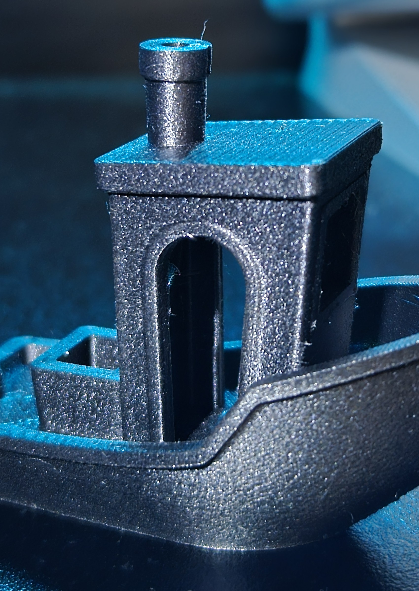
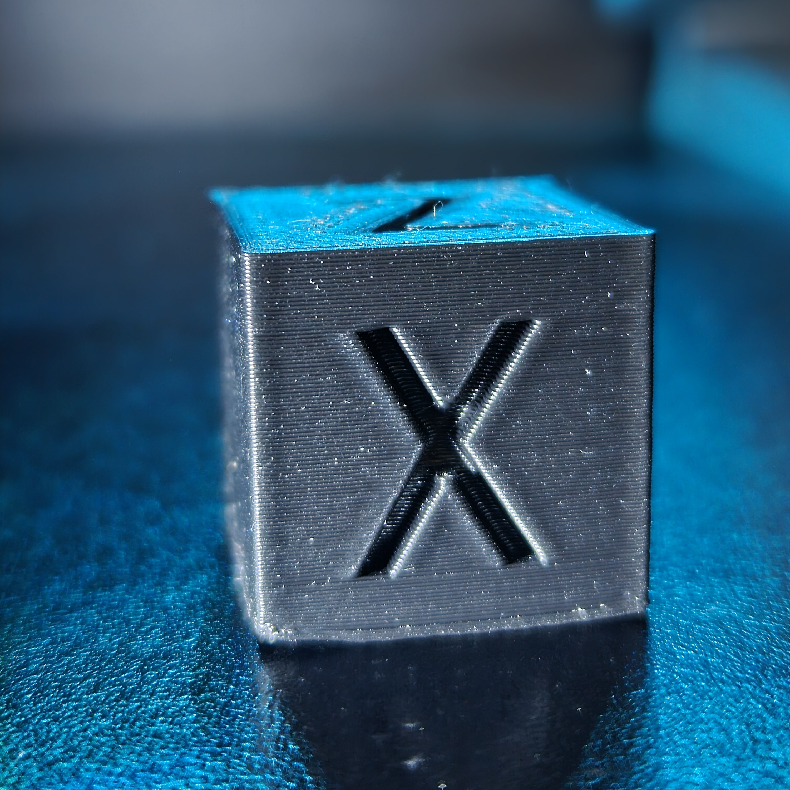
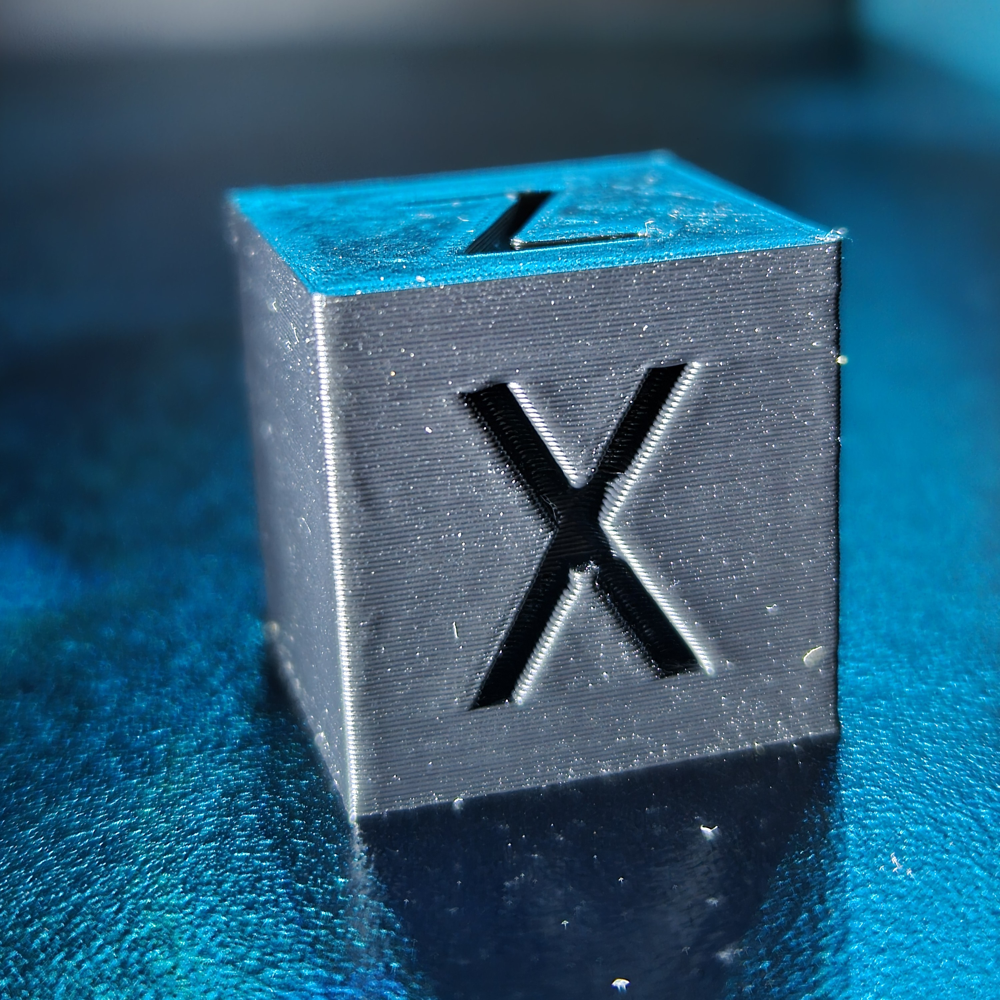
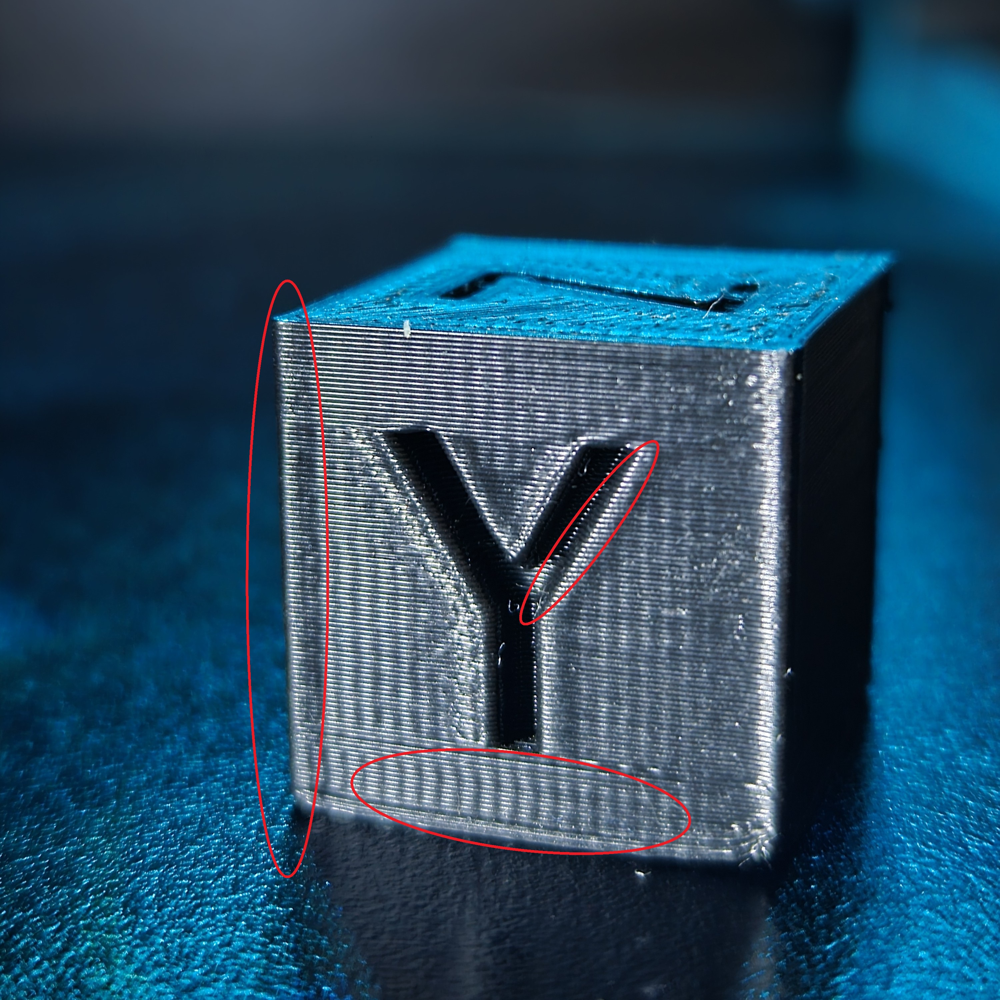
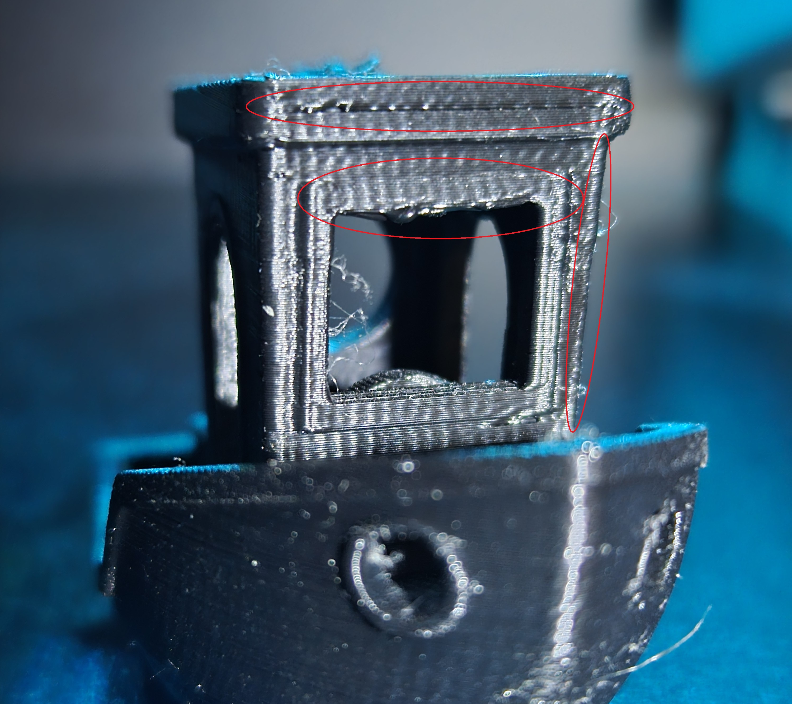
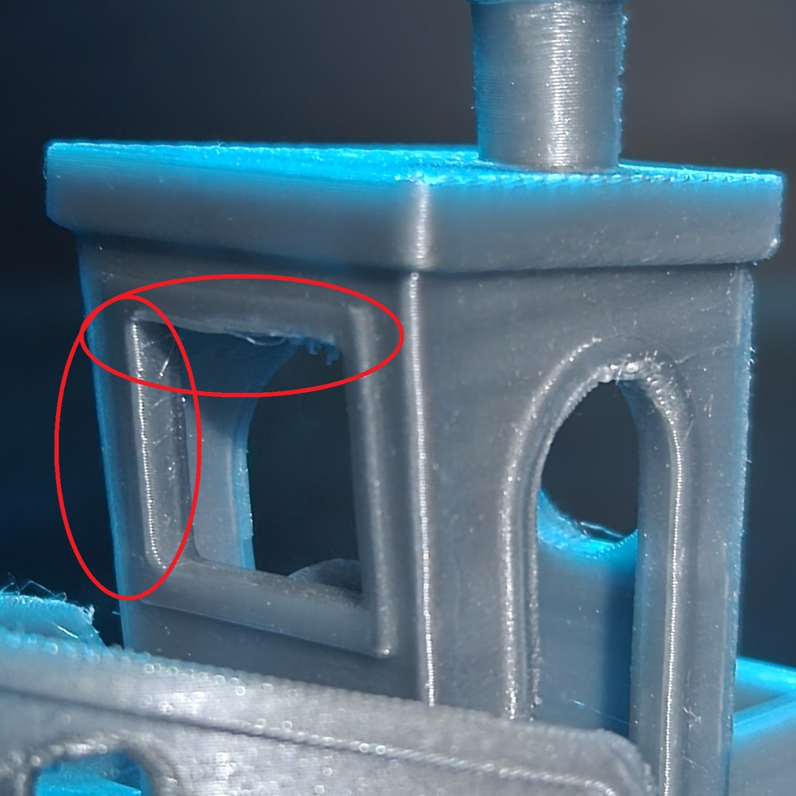
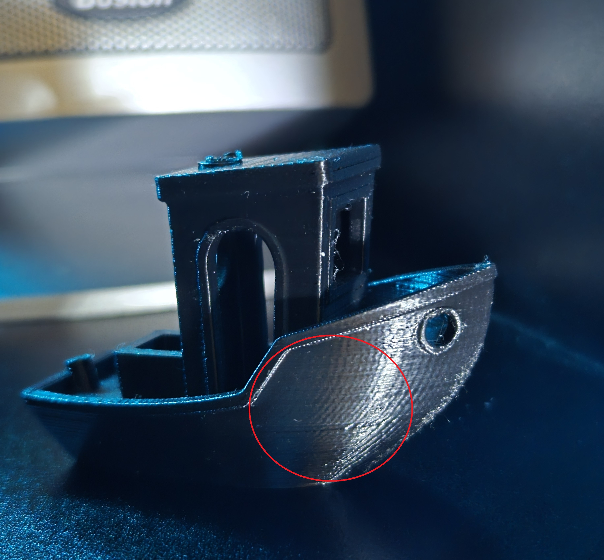
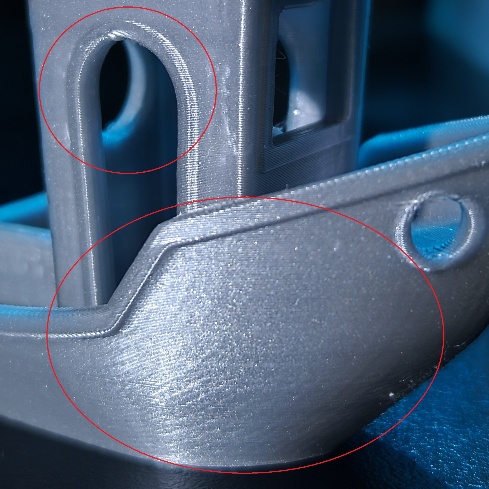

# Klipper – Sovol SV05 on Inovato Quadra

Klipper firmware installation, configuration, and tuning for the **Sovol SV05** (CoreXY Ender-5 clone) running on an **Inovato Quadra** SBC (Allwinner H616, Armbian). Covers OS setup, KIAUH stack installation, firmware flashing, and a full calibration workflow through input shaping and pressure advance.

---

## Results

<p align="center">
  
</p>

**Input Shaping — X Axis**
<p align="center"><em>Before &nbsp;|&nbsp; After</em></p>
<p align="center">
  
  
</p>

**Input Shaping — Y Axis**
<p align="center"><em>Before &nbsp;|&nbsp; After</em></p>
<p align="center">
  
  
</p>

**Benchy — Overhang**
<p align="center"><em>Before &nbsp;|&nbsp; After</em></p>
<p align="center">
  
  
</p>

**Benchy — Ringing / Stringing**
<p align="center"><em>Before &nbsp;|&nbsp; After</em></p>
<p align="center">
  
  
</p>

---
 
## Table of Contents
 
- [Hardware](#hardware)
- [Software](#software)
- [1. Restoring ArmbianOS on the Quadra](#1-restoring-armbianios-on-the-quadra)
- [2. Installing KIAUH, Klipper, Moonraker, Mainsail](#2-installing-kiauh-klipper-moonraker-mainsail)
- [3. Printer Configuration](#3-printer-configuration)
- [4. Mainsail Integrations](#4-mainsail-integrations)
- [5. Calibration & Tuning Workflow](#5-calibration--tuning-workflow)
- [6. Advanced Configuration](#6-advanced-configuration)
- [7. Troubleshooting](#7-troubleshooting)
- [8. Command Reference](#8-command-reference)
- [Credits & References](#credits--references)
 
---
 
## Hardware
 
| Component | Details |
|-----------|---------|
| **Host SBC** | Inovato Quadra — Allwinner H616 octa-core, running Armbian |
| **Printer** | Sovol SV05 — CoreXY Ender-5 clone |
| **MCU** | Creality 4.2.2 32-bit board (GD32F303VET6, STM32F103-style bootloader, 28 KiB) |
| **Accelerometer** | ADXL345 (input shaping) |
| **Camera** | Arducam USB (Crowsnest) |
| **Storage** | 32 GB microSD |
| **Network** | Wi-Fi via USB adapter |
 
---
 
## Software
 
| Component | Details |
|-----------|---------|
| **OS** | `Armbian-unofficial_24.5.0-trunk_Inovato-quadra_bookworm_current_6.6.22` |
| **Firmware stack** | Klipper + Moonraker + Mainsail via KIAUH |
| **Extras** | PrettyGCode, Crowsnest |
| **Ports** | Moonraker: `7125` — PrettyGCode: `7136` |
 
---
 
## 1. Restoring ArmbianOS on the Quadra
 
> Reference: [Inovato FAQ](https://inovato.com/pages/faq)
 
**Flash SD card:**
1. Download [Pi Installer](https://www.raspberrypi.com/software/) and the [Inovato Armbian image](https://inovato.com/pages/faq)
2. In Pi Installer: select **No Filtering** → **Use Custom Image** → select the `.img` file → select SD card target
3. Confirm with **Next → No → Yes** to begin flashing
 
**Boot and install:**
1. Insert SD into Quadra → power on → wait 10–20 min
2. LED sequence: red → blue → red → blue → stable blue = flashing complete
3. Connect monitor/keyboard/mouse and finish initial setup
4. Connect Wi-Fi (USB adapter recommended)
 
**Update system:**
```bash
sudo apt update && sudo apt upgrade -y
```
 
5. Install OS to eMMC, then remove SD card
 
> **Best practices:** Always perform a clean shutdown. Use surge protection or a UPS.
 
---
 
## 2. Installing KIAUH, Klipper, Moonraker, Mainsail
 
> Reference: [KIAUH GitHub](https://github.com/dw-0/kiauh)
 
**Update system:**
```bash
sudo apt update && sudo apt upgrade -y
```
 
**Clone and launch KIAUH:**
```bash
cd ~
git clone https://github.com/dw-0/kiauh.git
cd kiauh
./kiauh.sh
```
 
Inside the KIAUH menu, install: **Klipper, Moonraker, Mainsail, PrettyGCode, Crowsnest**
 
---
 
**Flash Sovol SV05 firmware:**
 
Use KIAUH's **[Build Firmware]** option with these settings:
 
| Setting | Value |
|---------|-------|
| MCU | STM32F103 |
| Bootloader offset | 28 KiB |
| Interface | USB (onboard) |
 
1. The generated `klipper.bin` must be renamed to `firmware.bin`
2. Copy to a microSD card, insert into the printer, power cycle
3. Wait for the board to flash, then power cycle again
 
**Verify MCU connection:**
```bash
ls /dev/serial/by-id/*
```
 
Update the `[mcu]` section in `printer.cfg` with the returned path.
 
**Access Mainsail:** `http://<printer_ip>`
 
---
 
## 3. Printer Configuration
 
> Reference: [printer-sovol-sv05-2022.cfg](https://github.com/Klipper3d/klipper/blob/master/config/printer-sovol-sv05-2022.cfg)
 
Key settings for the SV05:
 
| Setting | Value |
|---------|-------|
| MCU | STM32F103, 28 KiB bootloader |
| Interface | USB serial or USART1 (PA10/PA9) |
| Bed mesh | 5×5 grid, BLTouch homing |
 
Save config as `printer.cfg` and reboot.
 
---
 
## 4. Mainsail Integrations
 
> Reference: [Mainsail Docs](https://docs.mainsail.xyz)
 
- **UI:** Configure themes and dashboard layout in Mainsail settings
- **Cura integration:** Install the [Moonraker Connection](https://marketplace.ultimaker.com/app/cura/plugins/fieldofview/MoonrakerPlugin) plugin from the Cura Marketplace, then configure via **Settings → Printer → Manage Printers → Connect Moonraker**
- **Thumbnails:** Enable via Cura post-processing — add **Create Thumbnail** at 32×32 and 400×400
- **Webcam:** Configure Crowsnest in Mainsail for live feed
 
---
 
## 5. Calibration & Tuning Workflow
 
> References: [Teaching Tech](https://teachingtechyt.github.io/calibration.html) · [Pressure Advance](https://www.klipper3d.org/Pressure_Advance.html) · [Resonance Compensation](https://www.klipper3d.org/Resonance_Compensation.html) · [Measuring Resonances](https://www.klipper3d.org/Measuring_Resonances.html)
 
Calibration must be performed in order — each step depends on the accuracy of the last.
 
---
 
### Step 1 — Mechanical Checks
 
- Square the frame and check belt tension
- Manually move all axes to confirm smooth, unobstructed motion
 
---
 
### Step 2 — PID Tuning
 
```bash
PID_CALIBRATE HEATER=extruder TARGET=200
SAVE_CONFIG
PID_CALIBRATE HEATER=heater_bed TARGET=60
SAVE_CONFIG
```
 
---
 
### Step 3 — Extruder Calibration (E-steps)
 
Mark 100 mm on filament, extrude 100 mm, measure actual movement. Adjust `rotation_distance` in `printer.cfg` accordingly.
 
---
 
### Step 4 — Bed Mesh & Z-Offset
 
```bash
BED_MESH_CALIBRATE
PROBE_CALIBRATE
```
 
Validate with a 20×20 mm single-layer square.
 
---
 
### Step 5 — Flow Rate Calibration
 
Print a single-wall cube, measure wall thickness, adjust `extrusion_multiplier` or `rotation_distance`.
 
---
 
### Step 6 — Temperature Tower
 
```bash
TUNING_TOWER COMMAND="SET_HEATER_TEMPERATURE HEATER=extruder" PARAMETER=TARGET SKIP=1 START=190 STEP_DELTA=5 STEP_HEIGHT=5
```
 
Produces layers at 195 → 220 °C in 5 °C steps every 5 mm. Select the highest temperature with minimal stringing.
 
> **Note:** Quotes around the full `COMMAND=` value are required when the parameter includes a space.
 
---
 
### Step 7 — Retraction Tuning
 
**Distance tower** (start high, step down):
```bash
TUNING_TOWER COMMAND=SET_RETRACTION PARAMETER=DISTANCE START=4.0 STEP_DELTA=-0.2 STEP_HEIGHT=5
```
 
**Speed tower:**
```bash
TUNING_TOWER COMMAND=SET_RETRACTION PARAMETER=SPEED START=25 STEP_DELTA=5 STEP_HEIGHT=5
```
 
Optimal result on this machine: **3.8 mm @ 60 mm/s**. Note that 3.6 mm caused seam blobs; 3.8 mm provided the best balance.
 
---
 
### Step 8 — Pressure Advance
 
```bash
TUNING_TOWER COMMAND=SET_PRESSURE_ADVANCE PARAMETER=ADVANCE START=0 FACTOR=.005
```
 
Increment by 0.005 until corners sharpen. Confirm with bridges and fine details. Re-run after speed tuning.
 
---
 
### Step 9 — Input Shaping
 
**With ADXL345 accelerometer:**
```bash
TEST_RESONANCES AXIS=X
TEST_RESONANCES AXIS=Y
CALIBRATE_SHAPER
```
 
Apply the recommended shaper type and frequency to `[input_shaper]` in `printer.cfg`.
 
**Without accelerometer:** Print a ringing test pattern and adjust shaper values manually.
 
---
 
### Step 10 — Speed & Acceleration
 
Incrementally raise `max_accel` and `max_velocity`. Validate with towers and multi-hour prints.
 
> **Key finding:** `max_accel` above 2000 mm/s² caused repeatable layer separation at seams on this machine, even with input shaping and pressure advance enabled. The extruder cannot recover from retraction fast enough to keep up with XY acceleration beyond ~1500–2000 mm/s². Travel acceleration above 2000 mm/s² produced less than 4% total print time savings and is not worth the tuning overhead.
 
---
 
### Step 11 — Final Pressure Advance Pass
 
Re-run the PA tower after speed tuning to confirm values hold at final print speeds.
 
---
 
### Step 12 — Recalibration Protocol
 
When changing filament, re-run: **Temperature tower → Pressure Advance → Retraction** (retraction optional if filament type is the same).
 
---
 
## 6. Advanced Configuration
 
### Recommended printer.cfg Settings
 
```ini
[printer]
max_accel: 2000
square_corner_velocity: 4.0
 
[extruder]
max_extrude_only_accel: 2000
max_extrude_only_velocity: 60
```
 
### Slicer Acceleration Settings
 
| Zone | Acceleration |
|------|-------------|
| Walls | 1000 mm/s² |
| Infill | 2000 mm/s² |
| Travel | 2000 mm/s² |
 
### Extruder Dynamics
 
Practical retraction speed ceiling given `d=3.8 mm`, `a=2000 mm/s²`:
 
```
v_actual = min(requested, max_extrude_only_velocity, √(d × a))
         = min(60, 60, √(3.8 × 2000))
         = min(60, 60, ~87)
         = 60 mm/s
```
 
The `max_extrude_only_velocity` cap of 60 mm/s is the practical limit regardless of acceleration setting.
 
**Dynamic velocity adjustment:**
```bash
SET_VELOCITY_LIMIT EXTRUDE_ONLY_ACCEL=2000 EXTRUDE_ONLY_VELOCITY=60
```
 
---
 
## 7. Troubleshooting
 
### Seam Artifacts
 
Pressure advance alone does not eliminate seam blobs. Slicer settings that help:
 
- Enable **Outer Wall Wipe Distance** (start at 0.2–0.4 mm)
- Enable **Retract Before Outer Wall**
- Experiment with **Seam Placement** (aligned, random, back-facing)
- Lower nozzle temperature 5 °C if excessive oozing persists
 
> Z-hop does not fix seam blobs — it only prevents nozzle dragging.
 
> After PA tuning, return `square_corner_velocity` to default (5 mm/s or higher) and keep `smooth_time` at 0.04 s unless the extruder is unusually fast or noisy.
 
---
 
### Corners Curling
 
Caused by shrinkage or uneven cooling — not excessive bed temperature.
 
- **PLA:** Reduce fan speed on first few layers, add brim, eliminate drafts
- **PETG/ABS:** Raise bed temp slightly, use enclosure, add adhesion helpers
 
---
 
### First Layer Issues
 
**Lines flat but peeling** — adhesion issue, not Z-offset:
- Clean bed with isopropyl alcohol
- Increase bed temp by 5 °C
- Use glue stick, PEI sheet, or textured surface
 
**Bubbling brim** — typically over-extrusion or nozzle temp too high on dense infill:
- Reduce flow rate to 95–98%
- Lower nozzle temp 5–10 °C
- Check bed surface cleanliness
 
---
 
### Retraction Issues
 
| Setting | Value |
|---------|-------|
| Original (suboptimal) | 5.0 mm @ 45 mm/s |
| Optimized | 3.8 mm @ 60 mm/s |
 
3.6 mm caused blobs at seam; 3.8 mm was the optimal balance. Speed towers from 25–50 mm/s showed minimal visual difference — 60 mm/s was chosen for best responsiveness under higher acceleration.
 
Extruder stutter or lag under load indicates a need to raise `run_current` or consider a hardware upgrade.
 
---
 
## 8. Command Reference
 
```bash
# Temperature tower
TUNING_TOWER COMMAND="SET_HEATER_TEMPERATURE HEATER=extruder" PARAMETER=TARGET SKIP=1 START=190 STEP_DELTA=5 STEP_HEIGHT=5
 
# Retraction distance tower
TUNING_TOWER COMMAND=SET_RETRACTION PARAMETER=DISTANCE START=4.0 STEP_DELTA=-0.2 STEP_HEIGHT=5
 
# Retraction speed tower
TUNING_TOWER COMMAND=SET_RETRACTION PARAMETER=SPEED START=25 STEP_DELTA=5 STEP_HEIGHT=5
 
# Pressure advance tower
TUNING_TOWER COMMAND=SET_PRESSURE_ADVANCE PARAMETER=ADVANCE START=0 FACTOR=.005
 
# Input shaping
TEST_RESONANCES AXIS=X
TEST_RESONANCES AXIS=Y
CALIBRATE_SHAPER
 
# PID tuning
PID_CALIBRATE HEATER=extruder TARGET=200
PID_CALIBRATE HEATER=heater_bed TARGET=60
 
# Bed mesh
BED_MESH_CALIBRATE
PROBE_CALIBRATE
```
 
---
 
## Credits & References
 
**Firmware & Stack:**
- **Klipper** — Kevin O'Connor et al. [klipper3d/klipper](https://github.com/Klipper3d/klipper). GPL-3.0.
- **Moonraker** — Arksine. [Arksine/moonraker](https://github.com/Arksine/moonraker). GPL-2.0.
- **Mainsail** — meteyou et al. [mainsail-crew/mainsail](https://github.com/mainsail-crew/mainsail). GPL-3.0. [docs.mainsail.xyz](https://docs.mainsail.xyz)
- **KIAUH** — dw-0. [dw-0/kiauh](https://github.com/dw-0/kiauh). GPL-3.0.
- **Crowsnest** — mainsail-crew. [mainsail-crew/crowsnest](https://github.com/mainsail-crew/crowsnest).
 
**Hardware:**
- **Inovato Quadra** — [inovato.com](https://inovato.com). [Inovato FAQ / Armbian image](https://inovato.com/pages/faq)
- **Sovol SV05** — [sovol3d.com](https://sovol3d.com)
- **Klipper SV05 config reference** — [printer-sovol-sv05-2022.cfg](https://github.com/Klipper3d/klipper/blob/master/config/printer-sovol-sv05-2022.cfg)
 
**Calibration Guides:**
- **Teaching Tech Calibration Site** — [teachingtechyt.github.io/calibration.html](https://teachingtechyt.github.io/calibration.html)
- **Klipper Pressure Advance** — [klipper3d.org/Pressure_Advance.html](https://www.klipper3d.org/Pressure_Advance.html)
- **Klipper Resonance Compensation** — [klipper3d.org/Resonance_Compensation.html](https://www.klipper3d.org/Resonance_Compensation.html)
- **Klipper Measuring Resonances** — [klipper3d.org/Measuring_Resonances.html](https://www.klipper3d.org/Measuring_Resonances.html)
- **KUSBA docs** — [jlas1/KUSBA](https://github.com/jlas1/KUSBA)
 
